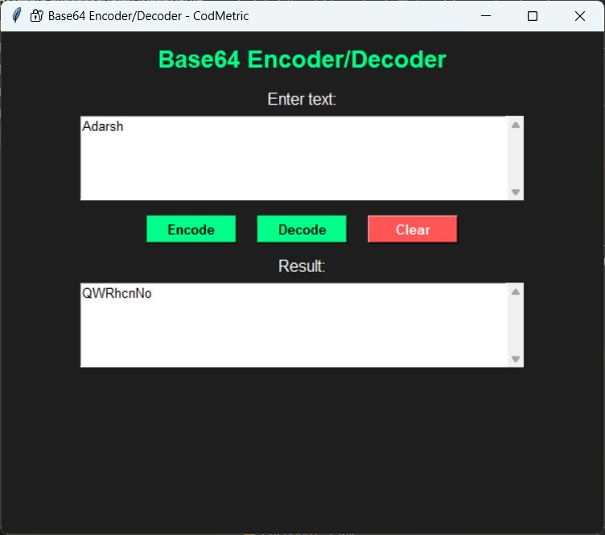

# codmetric_Base64-Encoder_Decoder
A Python-based Base64 Encoder and Decoder tool developed as part of the CodMetric Cybersecurity Internship. This CLI application allows users to securely encode text and decode Base64 strings, with input validation and error handling for a smooth experience.

# 🔐 Base64 Encoder/Decoder - CodMetric Task 5

A simple and secure Base64 Encoder/Decoder CLI tool built with Python. Created for the CodMetric Cybersecurity Internship to demonstrate understanding of data encoding and decoding.

## ⚙ Features
- Encode plain text into Base64
- Decode Base64 strings back to text
- Handles empty inputs and errors gracefully
- Easy-to-use command-line interface

## 🚀 How to Use
1. Clone or download the repo.
2. Run the script:
base64_encoder_decoder_tool_gui.py

3. Follow the prompt to encode or decode text.

## 🛠 EXE Version
To generate an executable:
pip install pyinstaller pyinstaller --onefile base64_tool.py

## 📁 Example
Input: Hello Encoded: SGVsbG8= Decoded: Hello

🖼️ Screenshot

📜 License
This project is licensed under the MIT License — feel free to use, modify, and share it.

🤝 Contributing
Contributions and improvements are welcome! Feel free to fork the repo and submit a pull request.

🔗 Connect
Made with ❤️ during a cybersecurity internship at CodMetric.
